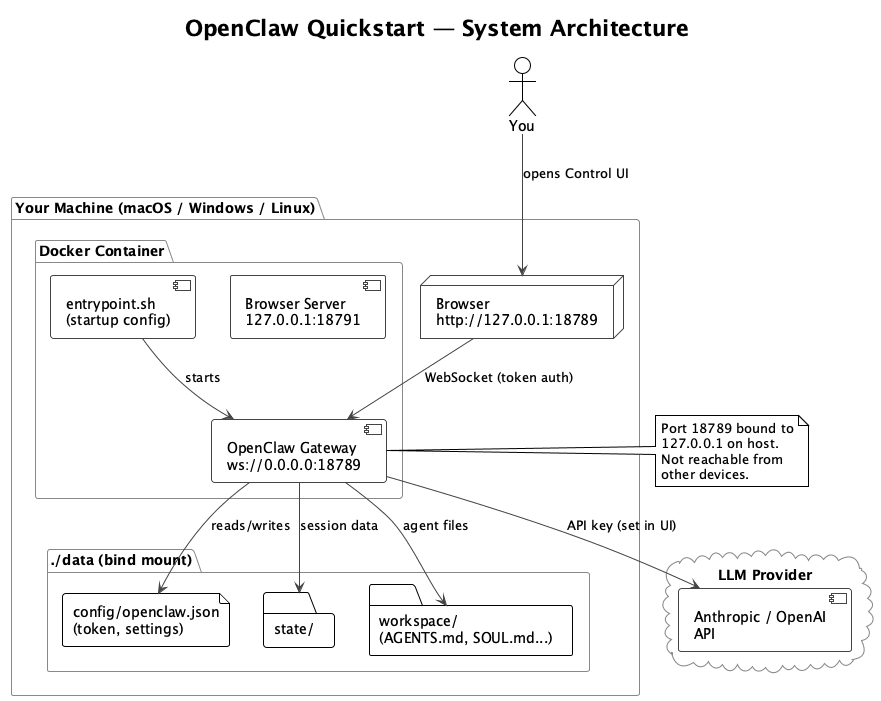
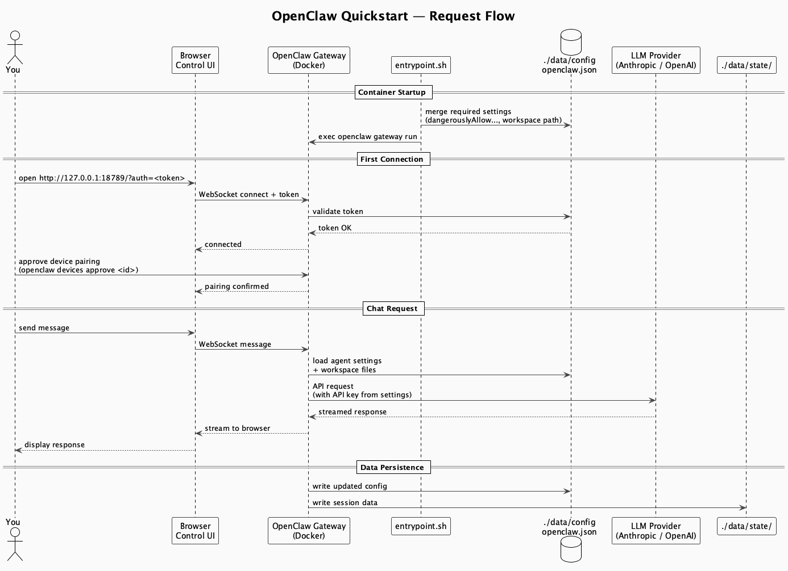

# OpenClaw Quickstart


> A containerized [OpenClaw](https://openclaw.ai) setup designed to get you from zero to a running AI gateway with as little pain as possible. No prior Docker experience needed, no manual installs, no "works on my machine" nonsense.
>
> If you can copy and paste, you can do this.

---

## What is this?

[OpenClaw](https://openclaw.ai) is a self-hosted AI gateway. This repo wraps it in Docker so you can spin it up on any machine without touching your system Python, Node, or anything else. Your settings, token, and agent workspace all persist in a local `./data` folder that never touches git.

Think of it as: **your AI, your machine, your rules.**

---

## Architecture

### System Layout



> Source: [architecture.puml](./diagrams/architecture.puml). View or edit with the [PlantUML extension](https://marketplace.visualstudio.com/items?itemName=jebbs.plantuml) in VSCode.

### Request Flow



> Source: [sequence.puml](./diagrams/sequence.puml).

---

## Requirements

Before you begin, make sure you have the following installed:

- **Docker Desktop** ([Download here](https://www.docker.com/products/docker-desktop/)). This includes both Docker and Docker Compose.
- **An API key** from your preferred LLM provider (e.g. [Anthropic](https://console.anthropic.com/), [OpenAI](https://platform.openai.com/))
- **Git** ([Download here](https://git-scm.com/downloads))

To verify Docker is installed, open a terminal and run:
```bash
docker --version
```
You should see a version number. If not, install Docker Desktop first.

> **Windows:** Use PowerShell or Windows Terminal. Docker Desktop requires WSL2; the installer will guide you through enabling it.
> **Linux:** Install [Docker Engine](https://docs.docker.com/engine/install/) and the Docker Compose plugin. Docker Desktop is optional.

---

## Setup

### 1. Clone the repo

**macOS / Linux:**
```bash
git clone https://github.com/M4K4TT4CK/openclaw-quickstart.git
cd openclaw-quickstart
```

**Windows (PowerShell):**
```powershell
git clone https://github.com/M4K4TT4CK/openclaw-quickstart.git
cd openclaw-quickstart
```

### 2. Build and start the container

```bash
docker compose up -d
```

This builds the Docker image (takes a few minutes the first time) and starts the container in the background. Grab a coffee.

> **Note:** This uses `docker compose` (no hyphen), which is Docker Compose V2 and comes bundled with Docker Desktop on macOS and Windows. On Linux, install the [Compose plugin](https://docs.docker.com/compose/install/linux/). If you only have the older `docker-compose` (with hyphen), [upgrade to V2](https://docs.docker.com/compose/migrate/).

To check it started successfully:
```bash
docker compose logs
```

You should see a line like:
```
[gateway] listening on ws://0.0.0.0:18789
```

### 3. Open the Control UI

Open your browser and go to:
```
http://127.0.0.1:18789
```

### 4. Get your auth token

The gateway generates a unique token on first run and requires it to connect. Retrieve it:

**macOS / Linux:**
```bash
docker compose exec openclaw cat /data/config/openclaw.json
```

**Windows (PowerShell):**
```powershell
docker compose exec openclaw cat /data/config/openclaw.json
```

Look for the `"token"` field in the output, e.g.:
```json
"token": "abc123yourtokenhere"
```

Open the Control UI with your token in the URL:
```
http://127.0.0.1:18789/?auth=abc123yourtokenhere
```

### 5. Approve the device pairing

The first time you connect, the UI will show a **pairing required** screen. This is by design; it stops anything other than your approved browser from connecting.

These commands run inside the container, so they are the same on macOS, Windows, and Linux:

```bash
# See what is waiting for approval
docker compose exec openclaw openclaw devices list

# Approve it (replace <requestId> with the ID shown above)
docker compose exec openclaw openclaw devices approve <requestId>
```

Go back to the browser; you should now be connected.

### 6. Add your API key

In the Control UI, go to **Settings** and add your LLM provider API key (e.g. Anthropic or OpenAI). This is required before you can chat. Your key is stored locally in `./data` and never committed to git.

---

## Useful Commands

**macOS / Linux:**
```bash
# View live logs
docker compose logs -f

# Check gateway status
docker compose exec openclaw openclaw gateway status

# Stop the container
docker compose down

# WARNING: deletes all data including machines, API keys, and token. Cannot be undone.
docker compose down && rm -rf ./data
```

**Windows (PowerShell):**
```powershell
# View live logs
docker compose logs -f

# Check gateway status
docker compose exec openclaw openclaw gateway status

# Stop the container
docker compose down

# WARNING: deletes all data including machines, API keys, and token. Cannot be undone.
docker compose down; Remove-Item -Recurse -Force .\data
```

---

## Configuration

Everything persists in `./data` on your machine. It survives container restarts and rebuilds. The only thing that wipes it is the nuclear command above.

```
./data/
  config/openclaw.json   your token, gateway settings, API key refs
  state/                 session history
  workspace/             agent files (AGENTS.md, SOUL.md, MEMORY.md...)
```

> **Security note:** The gateway port (18789) is bound to `127.0.0.1` only; it is accessible from your machine alone, not from other devices on your network or the internet. Each user who builds this gets their own unique auth token generated locally; no tokens are stored in this repo. The `dangerouslyAllowHostHeaderOriginFallback` flag is required to make the Control UI work inside Docker and is safe as long as the port is not publicly exposed.

Override data locations via environment variables in `docker-compose.yml`:

| Variable | Default |
|---|---|
| `OPENCLAW_STATE_DIR` | `/data/state` |
| `OPENCLAW_CONFIG_PATH` | `/data/config/openclaw.json` |
